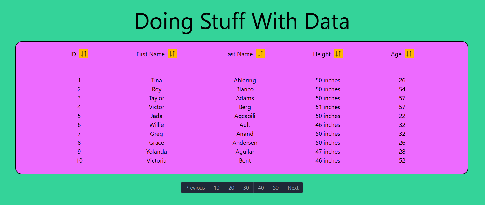

# Day 3: Doing Stuff With Data

**Description:**  Build out a table that is able to sort in ascending and descending order in each field with the data provided.

***Here are the requirements that are needed:***
- Designed
- Used Pagination
- Able to display 10, 20, 30, 40, and 50 results at a time
- Able to sort by ID, First Name, Last Name, Height, and Age
- Created Elements
- Used Import and Export
- Built in Vanilla JS
- Desktop Build
- Tested 

**Developer:** Michael Heckerman

**Date Revised:** 2/13/25

## Link(s):

[Github-Repo](https://github.com/mkheck13/DoingStuffWIthData25)

[Vercel](https://doing-stuff-w-ith-data25.vercel.app/)

